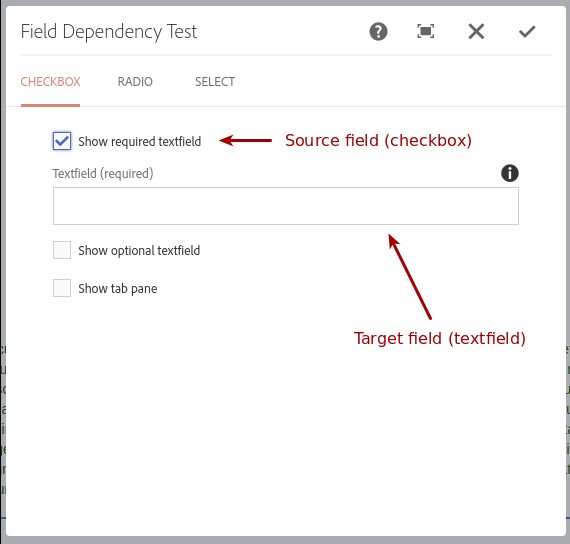

# Touch UI Authoring Extensions for AEM 6.3

System        | Status
--------------|------------------------------------------------        
CI master     | [![Build Status][travis-master]][travis-url]
CI develop    | [![Build Status][travis-develop]][travis-url]
Dependency    | [![Maven Central][maven-central-version]][maven-central]

With this project you will be able to use different authoring extensions in [Adobe Experience Manager 6.3](https://helpx.adobe.com/experience-manager/6-3/release-notes.html) Touch UI which lets you create improved dialogs.

## Usage

### Maven Dependency
```xml
    <dependency>
      <groupId>com.namics.oss.aem</groupId>
      <artifactId>authoring-extensions</artifactId>
      <version>1.0.1</version>
    </dependency>
```

### in AEM
Since the Touch UI Authoring Extensions are built as an OSGi bundle, only the bundle has to be installed into your AEM instance. 
With the common AEM archetype it can be added within the embedded configuration of the "content-package-maven-plugin" plugin.
```xml
    <plugin>
        <groupId>com.day.jcr.vault</groupId>
        <artifactId>content-package-maven-plugin</artifactId>
        <extensions>true</extensions>
        <configuration>
            ...
            <embeddeds>
                <embedded>
                    <groupId>com.namics.oss.aem</groupId>
                    <artifactId>authoring-extensions</artifactId>
                    <target>/apps/myProject/install</target>
                </embedded>
            </embeddeds>
        </configuration>
    </plugin>
```

### Features

#### Field dependency

The following screen shot shows an example of a text field only being shown if the checkbox has been selected: 


Use the field dependency in your _cq_dialog.xml of AEM 6.3 (with Touch UI) as follows:

##### Source field (field that contains the value)
Add attribute "fd-source-id" with a string identifier as its value.
<br/>E.g. fd-source-id="showRequiredTextfield").

```xml
<showRequiredTitle
    jcr:primaryType="nt:unstructured"
    sling:resourceType="granite/ui/components/foundation/form/checkbox"
    fd-source-id="showRequiredTextfield"
    name="./showRequiredTextfield"
    text="Show required textfield"
    uncheckedValue="false"
    value="{Boolean}true"/>
```

##### Target field (field that is shown / hidden based on source field's value)
Add attribute "fd-values-\<identifier\>" to each target field that should be shown/hidden. Replace "\<identifier\>" with the identifier you've chosen for the source field.
You can add one or more values separated by space. If any of these values were selected in the source field, this target field will be visible, otherwise it will be hidden.
<br/>E.g. fd-values-showRequiredTextfield="true" (will show the field if source field with attribute fd-source-id="showRequiredTextfield" has the value "true")

```xml
<requiredTitle
    jcr:primaryType="nt:unstructured"
    sling:resourceType="granite/ui/components/foundation/form/textfield"
    fd-values-showRequiredTextfield="true"
    fieldDescription="Max Characters: 54"
    fieldLabel="Textfield (required)"
    name="./checkboxRequiredTextfield"
    required="true"/>
```

#### Validators

##### Regex validator
Use the regex validator in your _cq_dialog.xml of AEM 6.3 (with Touch UI) as follows:

Add attribute "regex" with the regular expression as its value. If you want to print a custom error
message, you can also add the attribute "regex-errormsg" with the error message as its value.
<br/>E.g. regex="^(\\w)+$" will only allow word characters (a-z, A-Z, 0-9, _)

```xml
<textfield
    jcr:primaryType="nt:unstructured"
    sling:resourceType="granite/ui/components/foundation/form/textfield"
    regex="^(\\w)+$"
    regex-errormsg="Only word characters are allowed (a-z, A-Z, 0-9, _)."
    fieldLabel="Textfield"
    name="./textfield"/>
```

##### Rich text max. length validator
Use the rich text max. length validator in your _cq_dialog.xml of AEM 6.3 (with Touch UI) as follows:

Add attribute "maxlength" with the maximum number of characters as its value.
<br/>E.g. maxlength="100" will allow maximum 100 characters (HTML tags are not being taken into account)

```xml
<richtext
    jcr:primaryType="nt:unstructured"
    sling:resourceType="cq/gui/components/authoring/dialog/richtext"
    maxlength="100"
    fieldLabel="Richtext"
    name="./richtext"
    useFixedInlineToolbar="{Boolean}true"/>
```

### Requirements
* AEM 6.3 with Touch UI

### Development
Build locally with Maven
```
    mvn clean install -PautoInstallBundle
``` 


[travis-master]: https://travis-ci.org/namics/aem-authoring-extensions.svg?branch=6.3%2Fmaster
[travis-develop]: https://travis-ci.org/namics/aem-authoring-extensions.svg?branch=6.3%2Fdevelop
[travis-url]: https://travis-ci.org/namics/aem-authoring-extensions
[maven-central-version]: https://maven-badges.herokuapp.com/maven-central/com.namics.oss.aem/authoring-extensions/badge.svg
[maven-central]: https://maven-badges.herokuapp.com/maven-central/com.namics.oss.aem/authoring-extensions
